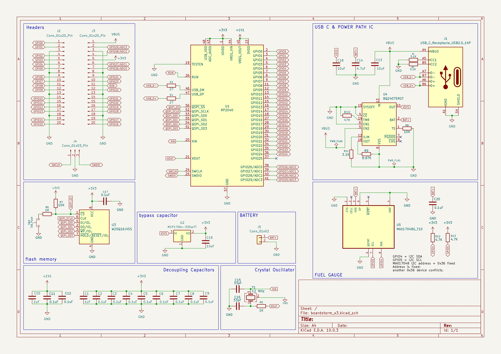
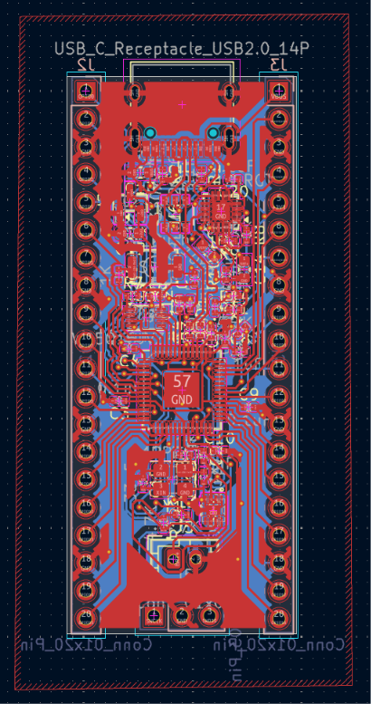
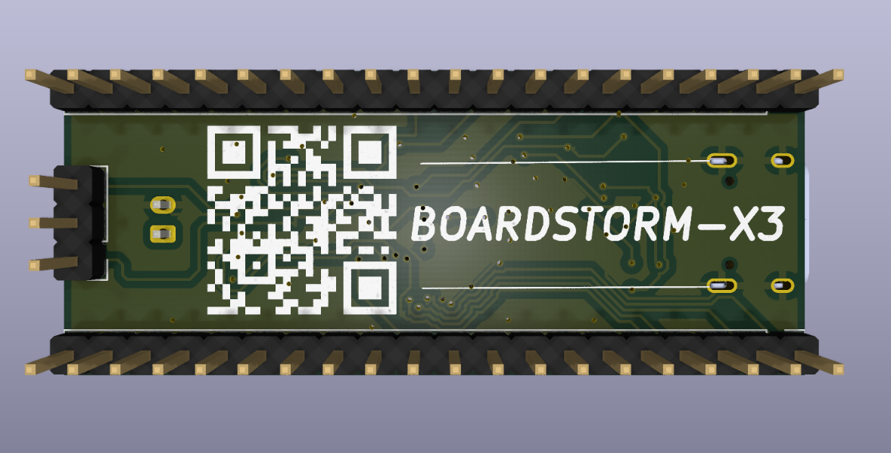

## May 26th, 2026: Setting up the project

**00:30 AM**
in my last project, ie- [keystorm-x3](https://github.com/shashwtd/keystorm-x3) i made a custom pcb macropad. now, in this project im making a custom devboard. since i am new to hardware and still need to learn a lot, i decided to follow [this guide](https://stasis.hackclub.com/starter-projects/devboard) by [KaiPierra](https://github.com/KaiPereira) to make this devboard. obviously im gonna make some changes of my own in later stages to keep it personalized and not a generic copy of the same. I'm quite excited for this. it's going to be technical. but i'm thankful since i dont have to do cad lol xD

**04:35 AM**
I took a lil break but eventually got myself back to working on the project. this has been very interesting so far. I am learning a lot of things and have made some nice progress. I was a bit scared at first since the schematics looked really scary but now that I'm actually making them step by step, I understand how it works and it makes a lot of sense too. I also learned how a receptacle works, how there are many kinds of it, and what capabilities the usb-c receptacle has it's all decided when it's built. I find this pretty interesting. I also understand better how capacitors work and i remember learning about a lot of these components back in my physics class in electronics chapter. attaching some images:

this is the progress ive made so far. ive worked on capacitors and the usb c power source. yay

**05:35 AM**
WOW!!! I kinda read the whole thing more carefully, did some research on the things i was confused about, studied about some of these parts that we're using and im very intrigued. I understand a lot better how the usb port in this board works, what pins are exactly used for what purpose, which one handles the data, which one is for the power delivery and all that. pretty cool stuff. I REALLY REALLY like how well engineered the **Crystal Oscillator** is.. it has to be the most interesting and probably my fav component so far. I did notice that the diagram on my schematic is a bit different from the one shown in tutorial? im a bit confused about that. but other than that, I see how it works. I did some research and it's very interesting. I always wondered how we keep track of everything and to such a precise level without consuming a lot of power and i think i finally understand. im currently working on the flash storage bit of the devboard and this is a screenshot of some of the progress ive made so far:

 **06:09 AM**
 been at it for more than 2 hours.. and WOW. I really really like how it's looking and it's hard to believe that im actually nearing the end of my schematic design. all the components make sense. i understand what im doing and i finished w the flash storage system which looks like this:

and this is how the board itself is looking like right now because I've breaked out all the GPIO's on the RP2040, onto header pins so that we can use them in our circuit etc. YAYYY

**07:58 AM**
I've been up all night and it's safe to say I'm absolutely fried. I took a lil break but I feel so groggy. However about the update, I added the header pin symbols into the schematics, very similar to raspberry Pi Pico pinout.. i was wondering when we will use those global labels and now finally I've done it. I'm also pretty much done with the schematic design and now I'm wondering to myself if I should push myself to add battery support as well... we'll see. im gonna commit this for now

(oh btw i really like how the final design turned out.. this schematic page looks really nice, i might get it printed out or something hehe)

> **total hours: 5.5**

---

## May 27th, 2026: fixing things & adding battery support

**02:10 AM**
hi, it was a good day, i was involved in some other things but i just had my fav burrito bowl and now am back to working. i saw a note mentioned in the guide about how this board won't support batteries & charging and would only work on USB power. i feel like if im making a board, and if i plan to use it in my projects, i need it to work well with batteries. hence, i decided to take up the challenge and am gonna do some research about how this works.. once i understand things better, i will implement battery & charging support.

but before that, i found a couple of issues that i need to fix ASAP:

- the resistors on my crystal oscillator were still on 15pF for some reason, i need to update them to 33pF to make sure the thing works well and operates at the right frequency.
- i also noticed that accidentally i messed up some namings in global labels. need to fix it. GPIO26 keeps getting repeated when ideally the pin number gets incremented.

- i accidentally set the damping resistor value to 5k instead of 1k, later realised that can really mess things up if not corrected.

**02:34 AM**
all the problems above are fixed, but I decided to some improvements as welll. for example:

- i swapped out the current flash storage which was 128Mbit(16MB) with a smaller component which only has 16Mbit(2MB)  and that's totally fine since our board only supports upto 16MB. we also save on physical space since this one has a smaller footprint compared to the previous
- i also swapped out the voltage regulator with a different one which is smaller in size
after these changes, the board would feel more compact which is a W. the original guide also made these changes later on before moving to pcb design

**23:30 PM**
okay, i dozed off but i picked pace again during night time and i did some research and prepared a plan for how im going to implement the battery support. right now, we take whatever power we get from the usb, pass it through a 3.3V regulator and pass it to the board. there's no way to use this board with a lipo battery or such, and since i want to build projects using this board later on, i decided to add battery support. 

 here's how the original structure looks:

> **total hours: 7.5**

---

## May 28th, 2026: still working on adding battery & charging

**01:40 AM**
here's how i modified my board to be like:

I added a few extra components to have the following features:

- LiPo battery support
- battery charging support
- allow checking battery status
- automatic switching between usb-c power & battery power

**06:20 AM**
i have been at it for a good 3 hours atleast and im starting to realise how difficult hardware is.. however, i did end up doing a lot of research and finalized on this [https://www.ti.com/product/BQ24075#order-quality](https://www.ti.com/product/BQ24075#order-quality) power path IC which i can connect to the power flow to add automatic switching, battery charging etc.. this is how i wired it all up:

yay

**07:12 AM**
added decoupling and voltage regulator. genuinely beyond tired now. going to sleep after this as soon as im done with some final changes. goodnight

**5:56 PM**
okay good morning, getting back to work now. next step is to add a fuel gauge. the one i ended up deciding on using is not available in kicad's default library. however, it's still commonly available and we can find it on snapeda website: [TADAAAAA](https://www.snapeda.com/parts/MAX17048G%2BT10/Analog%20Devices/view-part/?ref=dk&t=MAX17048&con_ref=None&ab_test_case=b) they have everything from symbol, to footprint & even the 3D model so wohooo. im now gonna import this in kicad so i can use it

**06:59 PM**
got the model, saved the schematic, footprint & the .step model to their respective folders. everything is present in PCB folder along with the project itself. 
i imported the symbol, wired everything up and this is what we have now:

if everything was right, the fuel gauge should be in place. I still need to setup bypass capacitors & I2C pullups.. anyways, another good thing is, this exact fuel gauge is available on many electronic stores so getting hands on it will be easy as well.

added some notes + setup the bypass capacitors and I2C pullups.. the fuel gauge should be more than done now. im now gonna organize the sheet.

**11:35 PM**
presenting to you, the fully finished schematic design of boardstorm-x3. i also made sure to label and organize everything properly. the next step is to connect all footprints and move on to pcb

> **total hours: 14**

---

## May 29th, 2026: footprints & PCB

**06:10 AM**
assigned footprints for the main parts, headers, battery connector, USB-C, button, and crystal. most choices are standard KiCad footprints, but I would still need to verify the exact JLCPCB/LCSC parts before ordering, especially USB-C, and the 12MHz crystal/load capacitors. the plan is to get PCBA done so things should be fine, as long as there is inventory

**08:42 AM** 
started with PCB design, did some basic steps, aligned the header pins, and put RP2040 in the center. yet this still looks like a crazy mess.. god knows how im gonna finish this

> **total hours: 16**

---

### May 30th, 2026: PCB is making me cry

**04:01 AM**
i completely forgot that i need to optimize my board further to make sure i am actually able to fit all these extra components i decided on adding. i need to use smaller footprints, different models and stuff. because there is absolutely no way i can fit all this in the same size board

**04:28 AM**
okay i did some optimizations and i see a lot more space now. rotated footprints to get smaller variations for these components:

- U3/flash storage
- capacitors
- resistors
- switch button
i think i can fit things better now?

**10:47 AM**
didn't sleep all night. but i do feel the design is coming along now. it was really complex to look at first but eventually it felt easier and also looks nicer now

**11:15 AM**
okay, figured the power components. this is how things are looking right now:

this feels a lot more complete, but i fear i may have placed the battery connector wrong. im gonna check what's the right way to do it and then make that change

> **total hours: 21**

---

### May 31st, 2026: need to do a lot of fixing in pcb routing

**09:03 PM**
hey!
i thought i wad one with my pcb and wiring stuff but i realised that it's super duper messed up. decided to run DRC and we've got 83 errors & 200+ warnings. that does not look good. I am aware that the majority is because i still have not wired up the power routes (GND, 3v3, etc..) and the warnings are mostly for silkscreen, but if you remove that we still got a couple of things we need to fix and revise on.
i spent like an hour of my day today just fixing some of these things. had to do a bunch of rewiring and also ive got some things to fix in the schematics. will brief more about them in a bit. the focus is to get the existing problems solved, and then we can add in new stuff.
AAAAAAAAA

bonus pic: 
(i went to a hardware event yesterday and got some pictures)

(this is a cool robo toy some guys built.. it looks pretty interesting, i might make one too)

(this is SO-ARM101, a popular open-source robotic arm platform made by [The Robot Studio](https://github.com/TheRobotStudio/SO-ARM100?utm_source=chatgpt.com) in collaboration with [Hugging Face LeRobot](https://huggingface.co/docs/lerobot/index?utm_source=chatgpt.com).  i plan to build one myself maybe later sometime? 
in this picture: you can see my hand controlling the other robotic arm.. this is the training phase, once the model has evolved, it can do the same on its own without human support.. pretty cool)

**10:58 PM**
this entire footprint is messed up oh god. i need to either download completely new footprints or adjust this one manually to make sure it works well. i think its a lot easier to just get the right footprints from a reliable website. 

i ended up getting my files from here: [https://www.analog.com/en/products/max17048.html](https://www.analog.com/en/products/max17048.html)

so hopefully this all should work now? gonna test soon
UPDATE: it worked, it's fixed now!!

> **total hours: 23**

---

### June 1st, 2026: i swear i will make it work today!

**00:41 AM**
what in the abomination

this is a big schematic issue. im fixing it!

okay nevermind, it was not that big of an issue. just my schematic got messed up and i did not notice it. it should be resolved now!! moving on...

**03:53 AM**
i took some nap.. however the board looks really good now.. 

this is how the 3d render turned out to be and I am very satisfied with how it looks. i really like the spiderman kinda shape that the wires are making.. it's missing a few cad models but it's fine. im gonna find them online and make it work.. other than that, here's what's pending:

- USBLC6-2SC6 (to protect high-speed interfaces like USB 2.0 from static electricity)
- add the ground and 3V3 wiring
- a power LED, for my satisfaction
- silkscreen graphics
- adding a 3d model for the usb maybe?

**05:48 AM**
okay so now we have a power LED in place, added a bunch of 3d models for any missing component so its nice to visualize it.. i also went through this dilemma of whether i should have the headers face front or back and eventually decided that since i can solder them myself (easy work), why don't i just get my PCB done and headers I will do based on the use case. easy peasy.
i also added an ESD protection IC so the flash memory dont get burned from a sudden static electricity jump. that's good. 

**07:21 AM**
okay i am done with EVERYTHING except the ground layer which i cant seem to figure out.. im gonna ask one of my friends to help out with this one. going to sleep now!! goodnight

the 3d render looks really good. also i flipped the headers on the back side yay

> **total hours: 27**

---

### June 27th, 2026: FIXING WHAT I LEFT, :<<<

**07:43 PM:**

 i realised i never got back to this project because i got lazy + forgot about it. i should genuinely finish up and then submit it.. im gonna fix the ground wiring and need to adjust a few things more to make sure this thing works well. might have to do some serious re-arrangement

**08:32 PM:**

okay im done with wiring. no more DRC errors. here's a clean looking pcb:

since im almost done i also went ahead and added a simple silkscreen with QR that leads to the project repository when i need to reference anything or such. this will be helpful in future when im actually putting this board to use!!

> **total hours: 28.5**